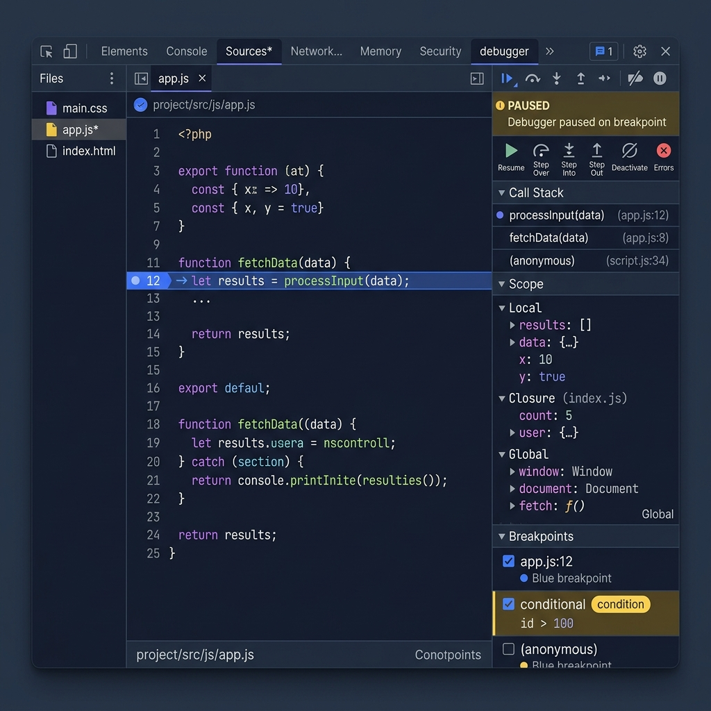

# 🛠️ Day 31: Browser Developer Tools & Advanced Debugging

Welcome to Day 31! In this module, we will explore the browser's hidden engine: **Chrome Developer Tools (DevTools)**. We will study how to inspect, isolate, trace, and debug complex JavaScript applications—moving from basic console logs to advanced breakpoints, call stack analysis, network throttling, memory leak profiles, and React component state tracking.

---

## 1. Mental Model: The X-Ray Scanner & Flight Recorder

Think of your web browser as a **Formula 1 Race Car**:
*   **The Viewport:** The outer car body that the driver sees.
*   **DevTools:** The telemetry station connected to the engine. It acts as:
    *   **An X-Ray Scanner (Elements/Application Panels):** Allows you to peer under the hood, adjust aerodynamic panels (CSS) in real-time, and check the fuel tank (Local Storage).
    *   **A Flight Recorder (Console/Sources/Network Panels):** Records every engine misfire (console errors), tracks telemetry data flow from sensors (network API payloads), and lets you pause time mid-race (breakpoints) to see which gear the transmission is in (call stack scope variables).

---

## 2. Visual Thinking: DevTools Sources debugger Interface

Here is a visual map of the Chrome DevTools debugger console layout:

```text
====================================== DEVTOOLS PANEL LAYOUT ======================================
┌─────────────────────────────────────────────────────────────────────────────────────────────────┐
│ Elements  Console  [Sources]  Network  Application  Performance  Memory  »                              │
├──────────────────────────┬──────────────────────────────────────────┬───────────────────────────┤
│ File Navigator           │ Code Editor Pane                         │ Debugger Controller Pane  │
│ 📂 src                   │ 12: function calculateTotal(price) {     │ ⏯ ↷ ↴ ↱ 🚫 🛑              │
│  ├─ 📄 index.html        │ 13:   const tax = price * 0.08;          │                           │
│  ├─ 📄 main.js           │ 14:●  return price + tax; ◄──[Breakpoint]│ ▼ Watch                   │
│  └─ 📄 api.js            │ 15: }                                    │   [tax]: 1.44             │
│                          │                                          │                           │
│                          │                                          │ ▼ Call Stack              │
│                          │                                          │   calculateTotal (main.js)│
│                          │                                          │   checkout       (main.js)│
│                          │                                          │                           │
│                          │                                          │ ▼ Scope                   │
│                          │                                          │   Local: { price: 18 }    │
│                          │                                          │   Global: Window          │
└──────────────────────────┴──────────────────────────────────────────┴───────────────────────────┘
```

Below is a premium graphic illustrating the actual DevTools panel components:



---

## 3. Beginner Explanation: The Essential Panels

Every developer must master these five core panels in their daily workflow:

### 1. The Elements Panel
Used to inspect and edit the DOM (HTML) and style definitions (CSS) dynamically:
*   **Inspect Tool:** Click the arrow icon (top-left of DevTools) and hover over any element on the page to target its HTML node.
*   **Live Tweaks:** Double-click any class name or inline style property to change colors, margins, or text values instantly.
*   **Inspect States:** Right-click a DOM node and select **Force state** (e.g. `:hover`, `:active`) to test animations and hover styles without hovering your cursor.

### 2. The Console Panel
The workspace command center:
*   **Standard Loggers:** Beyond `console.log()`, use custom console API formats:
    *   `console.table(users)`: Renders arrays of objects as a readable table.
    *   `console.time("timer")` & `console.timeEnd("timer")`: Measures the exact execution time of a code block in milliseconds.
    *   `console.error()` & `console.warn()`: Prints highlighted warning and error tracks.
    *   `console.group("User Details")` & `console.groupEnd()`: Nest logs inside collapsible group folders.

### 3. The Sources Panel
Where you debug JavaScript source files:
*   Use the file navigator on the left to select any script.
*   Click directly on any line number in the editor pane to add a **breakpoint**.
*   When code hits that line, the browser freezes execution, allowing you to trace variable values.

### 4. The Network Panel
Monitors traffic between your web client and external servers:
*   **Inspect Payloads:** Click any API request to see the HTTP **Headers**, query strings, request payloads, and raw JSON **Response** files.
*   **Disable Cache:** Check "Disable Cache" while DevTools is open to force the browser to fetch the freshest JS/CSS resources, preventing old file caching.

### 5. The Application Panel
Inspects browser-stored data:
*   **Storage types:** View and edit key-value records inside **Local Storage** (persistent storage), **Session Storage** (tabs storage), and **Cookies** (session identifiers).

---

## 4. Deep Explanation: Advanced Debugging Tactics

### 1. Types of Breakpoints
Using `console.log()` for debugging requires rewriting code, redeploying, and polluting console logs. Instead, use DevTools **Breakpoints**:

| Breakpoint Type | When to Use | How to Set |
| :--- | :--- | :--- |
| **Line-of-Code** | Pauses execution on a specific line. | Click a line number in the Sources editor. |
| **Conditional** | Pauses *only* if a custom expression evaluates to `true`. | Right-click line number ➔ **Add conditional breakpoint** (e.g., `item.price > 100`). |
| **Logpoint** | Logs a custom string without pausing execution. | Right-click line number ➔ **Add logpoint** (e.g., `User ID: {user.id}`). |
| **DOM Breakpoint** | Pauses when a DOM element's structure or attribute is modified. | Right-click element in Elements panel ➔ **Break on** ➔ **Subtree modifications**. |
| **XHR/fetch** | Pauses whenever an API call matching a URL string occurs. | Sources panel ➔ Expand **XHR/fetch Breakpoints** on right ➔ Add URL substring. |
| **Event Listener** | Pauses when a specific event (like a click) is triggered. | Sources panel ➔ Expand **Event Listener Breakpoints** ➔ Check `click`. |

---

### 2. Debugger Control Flow Navigation
When execution pauses at a breakpoint, use these buttons to step through execution:

*   **Resume script execution (⏯ / F8):** Resume running code until the next breakpoint is hit.
*   **Step over next function call (↷ / F10):** Run the current line of code and move to the next line. If the line contains a function, it executes the entire function in the background without jumping inside it.
*   **Step into next function call (↴ / F11):** If the current line contains a function call, jump inside that function to inspect its first line.
*   **Step out of current function (↱ / Shift+F11):** Execute the remainder of the current function and return back to the caller line.
*   **Deactivate breakpoints (🚫):** Temporarily disable all breakpoints.

---

### 3. Call Stack & Scopes Inspection
When paused, check the debugger's right-hand menus:
*   **Call Stack:** Shows the chain of function executions that led to the current line (e.g. `calculateTotal` called by `checkout`, called by `onClickHandler`). Click any function in the list to jump back to its scope.
*   **Scope Panel:** Inspects active variables categorized by:
    *   `Local`: Variables declared inside the currently paused function.
    *   `Closure`: Variables preserved via parent closures.
    *   `Script / Global`: Variables available to the wider script context.

---

### 4. Simulating Real-World Scenarios
*   **Network Throttling:** Under the **Network** panel, select the "No Throttling" dropdown to simulate **Slow 3G** or **Fast 3G**. Essential for verifying how your loading spinners or skeleton screens behave on poor mobile connections.
*   **Offline Testing:** Toggle the "Offline" checkbox to verify service worker caching or indexDB offline fallbacks.

---

## 5. Real Production Example: Tracing a Broken Payment Flow

Here is a broken shopping cart script. It crashes dynamically when calculating item discounts. Let's write a demo HTML page containing an inline script to trace its bug step-by-step.

```html
<!DOCTYPE html>
<html lang="en">
<head>
  <meta charset="UTF-8">
  <title>SaaS Payment Gateway Debugger</title>
  <style>
    body { font-family: sans-serif; background: #0f172a; color: #fff; padding: 40px; }
    .card { background: #1e293b; padding: 24px; border-radius: 12px; max-width: 400px; }
    button { background: #6366f1; border: none; padding: 10px 20px; color: #fff; border-radius: 6px; cursor: pointer; }
  </style>
</head>
<body>
  <div class="card">
    <h2>SaaS Checkout</h2>
    <p>Total Items: <strong id="item-count">3</strong></p>
    <button id="checkout-btn">Proceed to Payment</button>
    <p id="status" style="margin-top: 15px; color: #f87171;"></p>
  </div>

  <script>
    const mockCart = {
      items: [
        { name: "Premium SaaS Plan", price: 99 },
        { name: "Support Addon", price: 19 },
        { name: "Custom Domain", price: 0 } // Free item
      ],
      discountCode: "FREE_SUPPORT"
    };

    function applyDiscount(cart) {
      // DEBUGGER OPPORTUNITY: Add a breakpoint here to inspect local scope variables!
      const discountAmount = 19;
      cart.items.forEach(item => {
        if (item.price === 0) {
          // Division-by-zero or math logic error simulation:
          const discountRatio = discountAmount / item.price; // Infinity!
          item.price = item.price - discountRatio;
        } else {
          item.price = item.price - (discountAmount / cart.items.length);
        }
      });
    }

    function processCheckout() {
      const cartCopy = JSON.parse(JSON.stringify(mockCart));
      
      // Injecting a manual debugger pause in code
      debugger; 

      applyDiscount(cartCopy);
      
      let finalTotal = 0;
      cartCopy.items.forEach(item => {
        finalTotal += item.price;
      });

      if (isNaN(finalTotal) || !isFinite(finalTotal)) {
        throw new Error("Checkout calculation failure: Total is not finite.");
      }

      document.getElementById("status").style.color = "#4ade80";
      document.getElementById("status").textContent = `Success! Charged: $${finalTotal.toFixed(2)}`;
    }

    document.getElementById("checkout-btn").addEventListener("click", () => {
      try {
        processCheckout();
      } catch (err) {
        document.getElementById("status").textContent = `Error: ${err.message}`;
        console.error("Payment pipeline crash details:", err);
      }
    });
  </script>
</body>
</html>
```

### How to debug this flow:
1.  Open the code page in Chrome.
2.  Press `F12` to open DevTools, then navigate to the **Console** or **Sources** panel.
3.  Click the "Proceed to Payment" button.
4.  The browser immediately freezes inside the `processCheckout()` function because of the **`debugger;`** statement!
5.  In the right pane under **Scope**, expand `Local` to verify that `cartCopy` contains three items.
6.  Click **Step Into (F11)** to follow execution inside the `applyDiscount` function.
7.  Hover over `item.price` inside the loops: you will watch `discountRatio` evaluate to `Infinity` because the code divides by `0` on the free item, crashing the math check.
8.  Modify the code dynamically in DevTools or edit the file to add validation checks (e.g. `if (item.price > 0)`).

---

## 6. React Developer Tools (Advanced Console Extension)

If you are developing React applications, install the **React Developer Tools** browser extension. It adds two critical panels:

### 1. The Components Panel
Allows you to inspect your React functional component tree:
*   Click any component in the hierarchy tree to inspect its current **Props**, **State**, and resolved **Context** values in the right-hand panel.
*   Double-click a state variable value to edit it in real-time and observe the immediate UI response.
*   Shows the exact line where hooks are declared.

### 2. The Profiler Panel
Used to diagnose sluggish performance:
*   Click the record icon (blue circle) and interact with your app (e.g., type in an input or filter cards). Stop recording.
*   **Flamegraph Chart:** Shows component hierarchies colored by render duration (yellow is heavy, blue-green is fast, grey is skipped/memoized).
*   **Ranked Chart:** Sorts components by render time so you can instantly identify performance bottlenecks.

---

## 7. Common Mistakes

1.  **Leaving `debugger;` statements in production code:**
    If you commit code containing `debugger;`, users who open DevTools while loading your site will freeze, blocking their navigation. Always use build tools (like Vite minification) that strip out console logs and debugger lines during packaging.
2.  **Confusing the Call Stack function order:**
    The Call Stack builds upwards. The function at the very top is the one *currently* running; the function directly below it is the caller.
3.  **Forgetting to deactivate DOM breakpoints:**
    DOM breakpoints persist across page refreshes. If your page keeps pausing randomly on DOM modifications, check the "DOM Breakpoints" sub-pane in Sources to clear old triggers.

---

## 8. Best Practices

1.  **Clean up log pollution:** Use `console.group()` to group log outputs by API resource name or event handler, maintaining a tidy console feed.
2.  **Use Conditional Breakpoints in Heavy Loops:** If you are debugging a loop running 100 times, do not click F8 99 times. Set a conditional breakpoint `i === 99` to jump straight to the failure target.
3.  **Utilize Network Search:** Click the search icon in the Network panel to scan API response bodies for specific strings (e.g., search user email to find which API call returned it).

---

## 9. Interview Preparation

### Q1: What is the benefit of using the `debugger;` statement over `console.log()`?
**Answer:** `console.log()` requires modifying the code, redeploying, and dumps values to the console stream, which can create log pollution and expose user data. `debugger;` dynamically freezes the JS engine on that line *only* if DevTools is open. It allows inspects of all local scopes, closures, call stack lines, and execution path step-routing without altering variables or writing print updates.

### Q2: What is the Call Stack, and how does inspecting it help resolve stack overflow errors?
**Answer:** The Call Stack is a LIFO (Last-In-First-Out) stack structure tracking active function execution markers. When a function calls another, its call reference is pushed to the stack. When a function returns, its reference is popped off. If a recursive function runs without a base condition, the stack fills up (exceeding maximum size), throwing a "Maximum Call Stack Size Exceeded" stack overflow. DevTools allows inspecting the stack sequence to locate the recursive loop.

### Q3: How do you identify a memory leak using DevTools?
**Answer:** Under the **Memory** panel, run a **Heap Snapshot**. Take a snapshot, perform user operations (like opening and closing a modal multiple times), run a second snapshot, and compare them. Filter by "Objects allocated between snapshot 1 and 2". If the object count for detached DOM nodes or parent closures continues to rise without being garbage collected, you have found a memory leak.

---

## 10. Homework

1.  **Conditional Breakpoint Challenge:** Create a loop that logs integers 1 to 50. Set a conditional breakpoint that triggers a debugger pause *only* when the number is a multiple of 7.
2.  **Trace Event Listeners:** Open any complex site (e.g., Google or GitHub). Inspect a button in the Elements panel, check its registered event triggers under the **Event Listeners** sub-panel, find the source handler JS file, and add a line breakpoint.
3.  **Network Throttling Validation:** Open an API page, configure your Network speed to "Slow 3G", click refresh, and confirm how the layout handles loading indicators during delayed resource fetches.
4.  **Local Storage Manipulation:** Inspect the Application panel. Add a local storage key `test_key` with value `999`. Write a script console command `localStorage.getItem('test_key')` to print it, and then clear it manually using the panel GUI.
