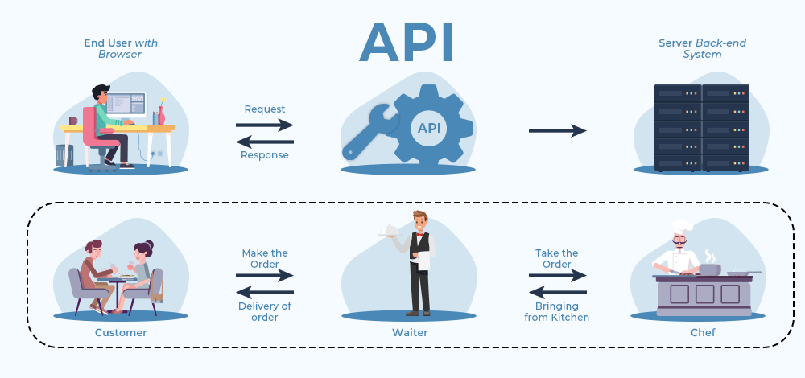

# Why Do We Need APIs?

APIs help developers to create software programs more easily. Instead of writing complex code from scratch, they can call APIs that already provide the functions they need. For example, if a developer wants to display a weather report, they can use an API to get the data instead of creating the entire system to gather weather data themselves.

APIs are also crucial in building modern websites, where heavy data transfers happen between the client (user) and the server.

# How Do APIs Work?

APIs work in a simple step-by-step process:

1. **Request**: A client (user) sends a request through the API's URI (Uniform Resource Identifier).
2. **Processing**: The API forwards the request to the server.
3. **Response**: The server processes the request and sends the response back to the API.
4. **Delivery**: The API returns the server's response to the client.

Think of this as a client-server architecture: the client sends a request, the server processes it, and the API acts as the messenger. Security threats. To provide additional security layers to the data, HTTP headers, query string parameters, or cookies are used.

Consider the URL: `https://www.example.com/products?category=electronics&brand=sony`

In this example:

- `category=electronics` is a URL parameter where:
  - "category" is the key
  - "electronics" is the value
- `brand=sony` is another URL parameter where:
  - "brand" is the key
  - "sony" is the value

These parameters instruct the server to display products that belong to the "electronics" category and are manufactured by "Sony."

Free API resources:

- [jsonplaceholder](https://jsonplaceholder.typicode.com/)
- [rapidapi](https://rapidapi.com/)
- [public-apis](https://github.com/public-apis/public-apis)
- [restful-api](https://restful-api.dev/)

---

- [api-ninjas](https://api-ninjas.com/)
- [apipheny](https://apipheny.com/)
- [apilayer](https://apilayer.com/)
- [rapidapi](https://rapidapi.com/)
- [postman](https://www.postman.com/)
- [mockapi](https://mockapi.io/)
- [mockbin](https://mockbin.com/)
- [jsonserver](https://jsonserver.org/)
- [json-generator](https://www.json-generator.com/)
- [jsonlint](https://jsonlint.com/)
