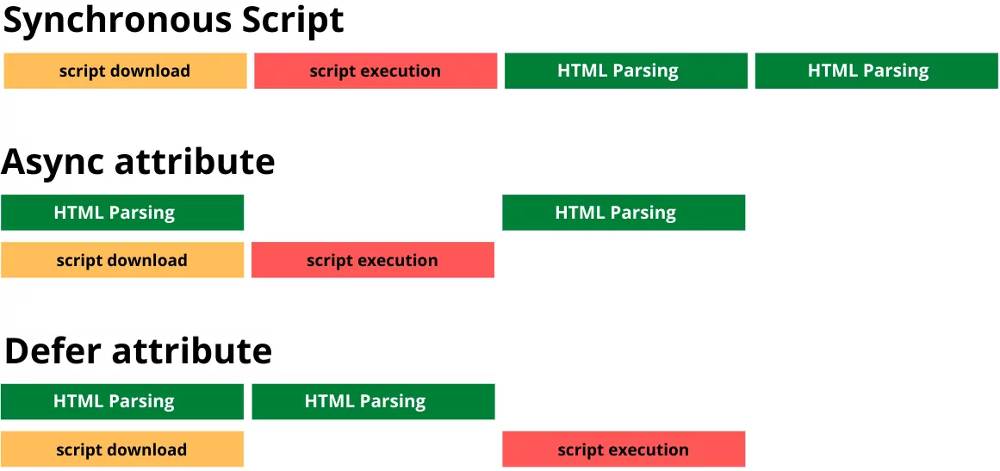

---

# 📊 Breakdown of the Script Loading Behaviors in the Image

---

## 🔴 1. **Synchronous Script (No `async` or `defer`)**

### 👇 What the image shows:

```
[ script download ] → [ script execution ] → [ HTML Parsing resumes ]
```

### 🔧 How it works:

- As the browser parses HTML and encounters a `<script>` **without `async` or `defer`**, it **pauses** parsing.
- It **downloads** the script (orange block), then **immediately executes** it (red block).
- Only after that, **HTML parsing resumes** (green blocks).

### 🧠 Real example:

```html
<head>
  <script src="main.js"></script>
</head>
```

### ⚠️ Why it's bad:

- **Blocks** the entire page from loading while the script is fetched and run.
- Leads to **slower page rendering**, especially on slow networks.

---

## 🟠 2. **Async Attribute (`<script async>`)**

### 👇 What the image shows:

```
[ HTML Parsing ] ➝  [ script download ] + [ script execution (interrupts parsing) ] ➝ [ resume HTML parsing ]
```

### 🔧 How it works:

- The script is downloaded **in parallel** (while HTML is being parsed).
- Once the script is ready, it is **executed immediately**, which **pauses HTML parsing**.
- After execution, HTML parsing resumes.

### 🧠 Real example:

```html
<head>
  <script src="analytics.js" async></script>
</head>
```

### ✅ Good for:

- **Independent scripts** (e.g. analytics, ads).
- When the script does **not depend on DOM** or **other scripts**.

### ❌ Not good for:

- Scripts that rely on the DOM being fully loaded.
- Scripts that depend on each other (execution order is not guaranteed).

---

## 🟢 3. **Defer Attribute (`<script defer>`)**

### 👇 What the image shows:

```
[ HTML Parsing continues normally ] ➝ [ script is downloaded in background ] ➝ [ script executed after parsing ends ]
```

### 🔧 How it works:

- The browser **starts downloading** the script in parallel with HTML.
- Unlike `async`, it **waits** to execute the script **after HTML parsing is complete**.
- **Does not block** rendering or parsing.

### 🧠 Real example:

```html
<head>
  <script src="app.js" defer></script>
</head>
```

### ✅ Good for:

- Scripts that need the **DOM to be ready**.
- **Main application code**.
- Multiple scripts that need to run **in order**.

---

# 🧠 Summary (Based on the Image)

| Type            | HTML Parsing Blocked? | Download in Parallel? | Execution Timing                  | Use Case Example              |
| --------------- | --------------------- | --------------------- | --------------------------------- | ----------------------------- |
| **Synchronous** | ✅ Yes                | ❌ No                 | Immediately on encounter          | Core config in `<head>`       |
| **Async**       | ⚠️ Sometimes          | ✅ Yes                | As soon as ready (even mid-parse) | Analytics, ads, tracking      |
| **Defer**       | ❌ No                 | ✅ Yes                | After HTML is fully parsed        | App scripts, DOM-dependent JS |

---

# 🚀 Visual Summary

- **Red = Bad for performance** (blocks parsing).
- **Orange = Download phase**.
- **Green = HTML Parsing**.

The **best combo for most use cases** is:

> ✅ **`<script src="your-app.js" defer>` placed in `<head>`**

---

Let me know if you'd like a **custom diagram**, cheat sheet, or a **code template** showing all these in action!

#### Resources

- [Defer vs Async JavaScript and how this affects the Core Web Vitals](https://www.corewebvitals.io/pagespeed/async-vs-defer-javascript-and-core-web-vitals#:~:text=In%20general%2C%20the%20async%20attribute,widgets%20or%20add%20event%20listeners)
